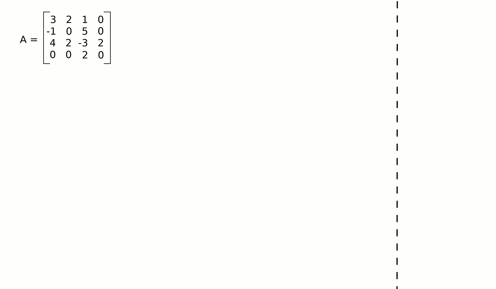

# Matrix Determinant  🟠

> Write functions that return the determinant of square matrix of orders
> ($2\times2$), ($3\times3$), and ($n\times n$).

## Rules

1. Function returns a integer.
2. You must not use any external function to calculate the determinant.

## Useful Links

- [Determinant](https://en.wikipedia.org/wiki/Determinant)
- [Minor of Matrix](https://www.cuemath.com/algebra/minor-of-matrix/)
- [Cofactor Expansion](https://textbooks.math.gatech.edu/ila/determinants-cofactors.html)

## Determinant overview

### Order ($2\times2$)

In the case of a ($2\times2$) matrix the determinant can be defined as

$$
\text{det}(A) = \text{det} \left( \begin{bmatrix}
a_{11} & a_{12} \\
a_{21} & a_{22}
\end{bmatrix} \right) = a_{11}a_{22} - a_{12}a_{21}

$$

### Larger Orders

#### Minor of Matrix

> Minor of matrix for a particular element in the matrix is defined as the
> matrix obtained after deleting the row and column of the matrix in which that
> particular element lies.
>
> \- [cuemath](https://www.cuemath.com/algebra/minor-of-matrix/)

:::{note}
See the [Minor of Matrix challenge](book/docs/arrays/minor.md) for more details.
:::

#### Cofactor of Matrix

The $(i,j)$ cofactor $C_{ij}$ is defined in terms of the minor $M_{i,j}$ by

$$
C_{ij} = (-1)^{i+j}\text{det}(M_{ij})
$$

#### Determinant using cofactor expansion along the $i^{\text{th}}$ row

For a Matrix $A$ like:

$$
A = \begin{bmatrix}
a_{11} & a_{12} & a_{13} \\
a_{21} & a_{22} & a_{23} \\
a_{31} & a_{32} & a_{33}
\end{bmatrix}
$$

You can use one arbitrary row and the cofactor expansion to get the determinant
of $A$:

$$
\text{det}(A) = \sum_{j=1}^{n} a_{ij}C_{ij}
$$

For example, if you chose the first row, the determinant is:

$$
\text{det}(A) = a_{11}C_{11} + a_{12}C_{12} + a_{13}C_{13}
$$

:::{note}
You can use any row you want.
:::

#### Recursive formula

> A recursive formula must have a starting point. For cofactor expansions,
> the starting point is the case of $1 \times 1$ matrices.
>
> \- [Dan Margalit, Joseph Rabinoff](https://textbooks.math.gatech.edu/ila/determinants-cofactors.html)

Consider a $1 \times 1$ matrix $A$ like:

$$
A = \begin{bmatrix}
a_{11}
\end{bmatrix}
$$

Then, the determinant of $A$ is:

$$
\text{det}(A) = a_{11}
$$

Therefore, to determine the determinant of any square matrix, you can
recursively apply the `cofactor expansion` up to the point that all matrix
have a $1 \times 1$ dimension.

### Example

